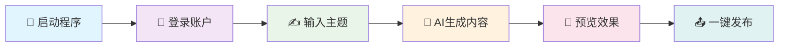

<div align="center">

<h1>🌟 小红书AI发布助手</h1>

   

<br/>

  

<br/><br/>

### 🎨 智能内容创作 • 🤖 AI驱动 • 📱 一键发布

[🇨🇳 简体中文](./readme.md) | [🇺🇸 English](./readme_en.md)

<br/>


</div>

---

## 🆕 1.6号更新

- 📊 **热点数据**：内置微博/百度/头条/B站等热榜，支持一键带回首页生成内容
- 🪧 **新增营销模板**：在「🖼️ 封面中心」可选 **营销海报🌟🌟🌟（本地生成 6 张图）/ 促销横幅 / 产品展示** 等
- 🖼️ **预览/下载体验升级**：首页支持一键打开「封面模板库」，并一键下载 **封面 + 多页内容图**
- 🎨 **UI 体验优化**：左侧编辑、右侧图片预览，生成流程更顺滑

## 📖 项目简介

> **小红书AI发布助手** 是一个功能强大的自动化内容创作与发布工具，专为小红书平台的内容创作者设计。

🎯 **核心价值**
- 🧠 **智能创作**: 基于先进AI技术自动生成高质量内容
- ⚡ **效率提升**: 一键操作节省90%发布时间
- 🎨 **专业品质**: 精美界面设计，用户体验极佳
- 🔧 **功能完整**: 从内容生成到发布全流程自动化

---

## ✨ 核心功能

<table>
<tr>
<td width="50%">

### 🤖 AI智能生成
- 🎯 **智能标题**: AI生成吸引人的标题
- 📝 **内容创作**: 基于主题自动生成文章
- 🔧 **自定义模型**: 支持配置 OpenAI 兼容/Claude/Ollama 等接口用于内容生成（未配置则回退到内置方案）
- 🧩 **文案模板**: 支持选择不同风格的提示词模板（`templates/prompts/*.json`），可自行扩展
- 📊 **热点采集**: 内置微博/百度/头条/B站等热榜，一键带回首页生成内容
- 🖼️ **图片处理**: 智能匹配和处理图片
- 🖼️ **封面/内容图模板**: 支持在「🖼️ 封面中心」选择模板（含营销海报/促销横幅/产品展示等），生成时自动输出封面 + 多页内容图（可一键下载）
- 🏷️ **标签推荐**: 自动推荐热门标签

</td>
<td width="50%">

### 🚀 自动化发布
- 📱 **一键登录**: 支持手机号快速登录
- 📋 **内容预览**: 发布前完整预览效果
- ⏰ **定时发布（无人值守）**: 支持任务管理与到点自动发布（需保持程序运行且账号已登录）
- 💾 **状态保存**: 自动保存登录状态

</td>
</tr>
<tr>
<td width="50%">

### 👥 用户管理
- 🔄 **多账户/用户管理**: 支持新增/切换/删除用户；登录态与数据按用户隔离
- 🌐 **代理配置**: 基于“浏览器环境”的默认项，已应用到发布会话（Playwright proxy）
- 🔍 **浏览器指纹**: 已应用到发布会话（UA/viewport/locale/timezone/geolocation 等）；更深层 WebGL/canvas 仍在完善
- 🗂️ **本地数据**: 用户/环境/配置/日志均落地本地（`~/.xhs_system/`）

</td>
<td width="50%">

### 🛡️ 安全稳定
- 🔐 **数据加密**: 模型 API Key 默认本地加密存储（`~/.xhs_system/keys.enc`）
- 🛡️ **反检测**: 先进的反检测技术
- 📝 **日志记录**: 完整的操作日志记录
- 🔄 **错误恢复**: 智能错误处理和恢复

</td>
</tr>
</table>

---

## 📁 项目架构

```
📦 xhs_ai_publisher/
├── 📂 assets/                       # 🧩 内置系统模板预览（可选）
├── 📂 templates/                    # 🧩 文案/封面模板（可自行扩展）
├── 🧰 install.sh                    # 📦 一键安装（macOS/Linux）
├── 🧰 install.bat                   # 📦 一键安装（Windows）
├── 📂 src/                          # 🔧 源代码目录
│   ├── 📂 core/                     # ⚡ 核心功能模块
│   │   ├── 📂 models/               # 🗄️ 数据模型
│   │   ├── 📂 services/             # 🔧 业务服务层
│   │   ├── 📂 pages/                # 🎨 界面页面
│   │   ├── 📂 processor/            # 🧩 内容/图片处理
│   │   ├── 📂 scheduler/            # ⏰ 定时任务（到点自动发布）
│   │   └── 📂 ai_integration/       # 🤖 AI适配（实验）
│   ├── 📂 web/                      # 🌐 Web接口
│   │   ├── 📂 templates/            # 📄 HTML模板
│   │   └── 📂 static/               # 🎨 静态资源
│   └── 📂 logger/                   # 📝 日志系统
├── 📂 images/                       # 🖼️ 文档/界面截图资源
├── 📂 docs/                         # 📚 文档
├── 📂 tests/                        # 🧪 测试目录
├── 📂 venv/                         # 🐍 本地虚拟环境（已在 .gitignore，不会上传 GitHub）
├── 🐍 main.py                       # 🚀 主程序入口
├── 🚀 启动程序.sh                   # ▶️ 启动脚本（macOS/Linux）
├── 🚀 启动程序.bat                  # ▶️ 启动脚本（Windows）
├── ⚙️ .env.example                  # 🔑 环境变量示例（不要提交真实 .env）
├── 📋 requirements.txt              # 📦 依赖包列表
└── 📖 readme.md                     # 📚 项目说明
```

---

## 🛠️ 快速开始

### 📋 系统要求

<div align="center">

| 组件 | 版本要求 | 说明 |
|:---:|:---:|:---:|
| 🐍 **Python** | `3.8+` | 推荐使用最新版本 |
| 🌐 **Chrome** | `最新版` | 用于浏览器自动化 |
| 💾 **内存** | `4GB+` | 推荐8GB以上 |
| 💿 **磁盘** | `2GB+` | 用于存储依赖和数据 |

</div>

> Windows 建议使用 **Python 3.11/3.12（64 位）**；Python 3.13 或 32 位 Python 常见会导致 **PyQt5 安装失败**。

### 🚀 安装方式

#### 🎯 一键安装（推荐）

| 操作系统 | 安装脚本 | 启动脚本 |
|:---:|:---:|:---:|
| macOS / Linux | `./install.sh` | `./启动程序.sh` |
| Windows | `install.bat` | `启动程序.bat` |

```bash
# macOS/Linux
chmod +x install.sh 启动程序.sh
./install.sh
./启动程序.sh
```

```bat
:: Windows
install.bat
启动程序.bat
```

> 默认会检测 Playwright 浏览器并在缺失时自动安装；可用参数：
> - 强制安装：`./install.sh --with-browser` / `install.bat --with-browser`
> - 跳过浏览器：`./install.sh --skip-browser` / `install.bat --skip-browser`

#### 📥 手动安装（高级用户）

```bash
# 1️⃣ 创建虚拟环境
python -m venv venv

# 2️⃣ 激活虚拟环境（macOS/Linux）
source venv/bin/activate

# 3️⃣ 安装依赖
pip install -r requirements.txt

# 4️⃣ （可选）安装 Playwright Chromium
PLAYWRIGHT_BROWSERS_PATH="$HOME/.xhs_system/ms-playwright" python -m playwright install chromium

# 5️⃣ 启动程序（首次启动会自动初始化数据库）
./启动程序.sh
```

提示：
- 运行数据默认存放于 `~/.xhs_system/`（数据库、日志、浏览器缓存等）

常见问题：
- Windows 安装失败（多为 PyQt5）：请用 Python 3.11/3.12（64 位），避免 Python 3.13 或 32 位 Python
- Linux 浏览器启动失败：可能缺少系统依赖，执行 `sudo python -m playwright install-deps chromium`（或对应发行版命令）
- `qt.qpa.fonts ... Microsoft YaHei`：Qt 的字体告警，可忽略；当前版本已改为自动选择系统可用字体

---

## 📱 使用指南

> 📘 更完整的小红书「选题/写法/封面/发布/运营」教程： [小红书从 0 到 1 教程](./docs/xhs_tutorial.md)

### 🎯 基础使用流程

<div align="center">



</div>

### 📝 详细步骤

1. **🚀 启动程序**
   - 运行 `./启动程序.sh` 或 `python main.py`
   - 等待程序加载完成
	
2. **👥 用户管理（可选）**
   - 侧边栏「👥」支持新增/切换/删除用户
   - 登录态、浏览器环境、cookie/token 等数据按用户隔离

3. **🌐 浏览器环境（可选）**
   - 侧边栏「🌐」创建环境，并可设置“⭐ 默认环境”
   - 默认环境的代理/基础指纹会应用到发布会话（UA/viewport/locale/timezone/geolocation 等）

4. **📊 数据中心（可选）**
   - 侧边栏「📊」查看多平台热榜
   - 选中热点后点击「✍️ 用作首页主题」一键带回首页生成

5. **🖼️ 封面模板（可选）**
   - 侧边栏「🖼️」进入封面中心选择模板，并「✅ 应用到首页」
   - 也可在首页右侧预览区点击「🧩 封面模板」快速跳转

6. **📱 账户登录**
   - 输入手机号码
   - 接收并输入验证码
   - 系统自动保存登录状态

7. **✍️ 内容创作**
   - 在主题输入框输入创作主题
   - 点击"生成内容"按钮
   - AI自动生成标题和内容

8. **🖼️ 图片处理**
   - 系统自动匹配相关图片
   - 可手动上传自定义图片
   - 支持多图片批量处理

9. **👀 预览发布**
   - 点击"预览发布"查看效果
   - 确认内容无误后点击发布
   - 或点击「⏰ 定时发布」设置时间，到点自动发布（需保持程序运行且账号已登录）

---

## 🤖 自定义模型与模板

- 入口：侧边栏「⚙️ 后台配置」→「AI模型配置」
- API Key：保存时默认加密写入 `~/.xhs_system/keys.enc`（`settings.json` 不再明文保存）
- 文案模板：在「文案模板」下拉框选择；模板文件位于 `templates/prompts/`
- 系统图片模板：侧边栏「⚙️ 后台配置」→「模板库」可选择/导入（将外部模板导入到 `~/.xhs_system/system_templates`，便于跨平台使用）
- 封面模板：侧边栏「🖼️ 封面中心」选择并应用到首页；生成图片默认缓存于 `~/.xhs_system/generated_imgs/`，可在首页「📥 下载图片」导出
- 远程工作流：已移除（不再发起远程工作流请求），仅使用本地配置的模型或内置回退生成


## 🔧 高级配置

### 📁 数据与配置位置

- `~/.xhs_system/settings.json`：应用配置（手机号/标题/模型/模板等）
- `~/.xhs_system/keys.enc`：模型 API Key 加密存储
- `~/.xhs_system/xhs_data.db`：本地数据库（用户/浏览器环境等）
- `~/.xhs_system/generated_imgs/`：生成图片缓存
- `~/.xhs_system/ms-playwright/`：Playwright 浏览器缓存目录
- `~/.xhs_system/logs/`：运行日志
- `~/.xhs_system/hotspots_cache.json`：热点缓存
- `~/.xhs_system/schedule_tasks.json`：定时发布任务

### 🌐 代理/指纹

- 入口：侧边栏「🌐 浏览器环境」
- 默认环境会应用到发布会话（代理/UA/viewport/locale/timezone/geolocation 等）
- 更深层指纹（WebGL/canvas 等）仍在完善

---

## 📊 开发路线图

<div align="center">

### 🗓️ 开发计划

</div>

- [x] ✅ **基础功能**: 内容生成和发布
- [x] ✅ **用户管理**: 多账户/当前用户切换/数据隔离
- [x] ✅ **代理/指纹**: 浏览器环境管理 + 发布会话接入（深度指纹持续完善）
- [x] ✅ **模板库**: 文案模板 + 系统图片模板导入 + 封面模板库
- [x] ✅ **数据中心**: 多平台热榜采集 + 一键带回首页生成
- [x] ✅ **定时发布**: 支持任务管理与到点自动发布（需保持程序运行）
- [ ] 🔄 **发布效果分析**: 数据统计/分析面板持续完善
- [ ] 🔄 **API接口**: 开放API接口

---

## 🤝 参与贡献

<div align="center">

**🎉 我们欢迎所有形式的贡献!**


</div>

### 🛠️ 贡献指南

1. 🍴 Fork 项目
2. 🌿 创建功能分支 (`git checkout -b feature/AmazingFeature`)
3. 💾 提交更改 (`git commit -m 'Add some AmazingFeature'`)
4. 📤 推送到分支 (`git push origin feature/AmazingFeature`)
5. 🔄 创建 Pull Request

---

## 📞 联系我们

<div align="center">

### 💬 加入我们的社区

<table>
<tr>
<td align="center">

<br/>
<strong>🐱 微信群</strong>
<br/>
<em>扫码加入讨论</em>
</td>
<td align="center">

<br/>
<strong>📱 公众号</strong>
<br/>
<em>获取最新动态</em>
</td>
</tr>
</table>

<br/>


</div>

---

## ⭐ Star 历史

[](https://star-history.com/#betastreetomnis/xhs_ai_publisher&Date)

---

## 📄 许可证

<div align="center">

本项目采用 **Apache 2.0** 许可证 - 查看 [LICENSE](LICENSE) 文件了解详情

<br/>


<br/><br/>

---

<sub>🌟 为小红书内容创作者精心打造 | Built with ❤️ for Xiaohongshu content creators</sub>

<br/>

**⭐ 如果这个项目对您有帮助，请给我们一个星标!**

</div>
