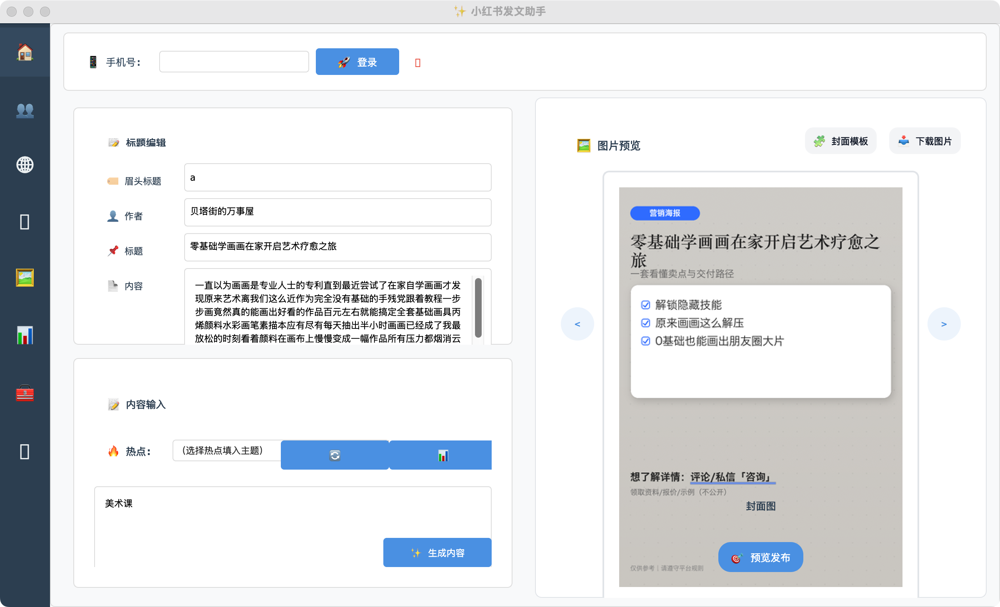
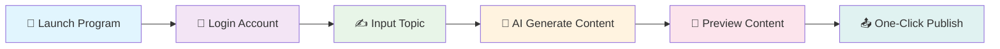

# 🌟 Xiaohongshu AI Publisher

<div align="center">


<br/>


<br/><br/>

<h3>🎨 Smart Content Creation • 🤖 AI-Powered • 📱 One-Click Publishing</h3>

[🇨🇳 简体中文](./readme.md) | [🇺🇸 English](./readme_en.md)

<br/>



</div>

---

## 🆕 Jan 6 Update

- 📊 **Hotspot data**: built-in hot lists (Weibo/Baidu/Toutiao/Bilibili), one-click to use as the homepage topic
- 🪧 **New marketing templates**: pick **Marketing Poster (locally renders 6 images) / Promo Banner / Product Showcase** in “🖼️ Cover Center”
- 🖼️ **Preview & download improvements**: open the cover template library and download **cover + content images** directly from the homepage
- 🎨 **UI flow improvements**: left-side editing with right-side image preview

## 📖 Project Overview

> **Xiaohongshu AI Publisher** is a powerful automated content creation and publishing tool, specifically designed for content creators on the Xiaohongshu platform.

🎯 **Core Values**
- 🧠 **Smart Creation**: Generate high-quality content with advanced AI technology
- ⚡ **Efficiency Boost**: One-click operation saves 90% of publishing time
- 🎨 **Professional Quality**: Beautiful interface design with excellent user experience
- 🔧 **Complete Features**: Full automation from content generation to publishing

---

## ✨ Core Features

<table>
<tr>
<td width="50%">

### 🤖 AI Smart Generation
- 🎯 **Smart Titles**: AI-generated engaging titles
- 📝 **Content Creation**: Auto-generate articles based on topics
- 🔧 **Custom Models**: Configure OpenAI-compatible / Claude / Ollama endpoints for generation (falls back to built-in methods if not configured)
- 🧩 **Prompt Templates**: Choose different writing styles via templates (`templates/prompts/*.json`), and extend them easily
- 📊 **Hotspot Center**: Built-in hot lists (Weibo/Baidu/Toutiao/Bilibili), one-click to use as homepage topic
- 🔗 **Web Link Import**: Paste a link to import title/content/images (WeChat articles + generic webpages; results depend on the site)
- 🖼️ **Image Processing**: Smart image matching and processing
- 🖼️ **Cover/Content Templates**: Choose a template in “🖼️ Cover Center” (including marketing poster/promo banner/product showcase); generation outputs a cover + multiple content images (one-click download)
- 🏷️ **Tag Recommendations**: Auto-recommend trending tags

</td>
<td width="50%">

### 🚀 Automated Publishing
- 📱 **One-Click Login**: Quick login with phone number
- 🧩 **Import Login State**: Import Xiaohongshu login state from your system Chrome (useful for SMS/QR risk-control flows)
- 📋 **Content Preview**: Complete preview before publishing
- ⏰ **Scheduled Publishing (Unattended)**: Task management + publish at the scheduled time (app must stay running and account must be logged in)
- 💾 **State Saving**: Auto-save login status

</td>
</tr>
<tr>
<td width="50%">

### 👥 User Management
- 🔄 **Multi-Account / Users**: Create/switch/delete users; login/session data is isolated per user
- 🗂️ **Local Storage**: Users/environments/config/logs are stored locally under `~/.xhs_system/`

</td>
<td width="50%">

### 🛡️ Security & Stability
- 🔐 **Data Encryption**: Model API keys are stored locally with encryption by default (`~/.xhs_system/keys.enc`)
- 📝 **Logging**: Complete operation logging
- 🔄 **Error Recovery**: Smart error handling and recovery

</td>
</tr>
</table>

---

## 📁 Project Architecture

```
📦 xhs_ai_publisher/
├── 📂 assets/                       # 🧩 Bundled template showcase (optional)
├── 📂 templates/                    # 🧩 Prompt/Cover templates (extendable)
├── 📂 docs/                         # 📚 Documentation
├── 🧰 install.sh                    # 📦 One-click install (macOS/Linux)
├── 🧰 install.bat                   # 📦 One-click install (Windows)
├── 📂 src/                          # 🔧 Source Code Directory
│   ├── 📂 core/                     # ⚡ Core Functionality Modules
│   │   ├── 📂 models/               # 🗄️ Data Models
│   │   ├── 📂 services/             # 🔧 Business Service Layer
│   │   ├── 📂 pages/                # 🎨 UI Pages
│   │   ├── 📂 processor/            # 🧩 Content/Image processing
│   │   ├── 📂 scheduler/            # ⏰ Scheduling (publish at scheduled time)
│   │   └── 📂 ai_integration/       # 🤖 AI adapters (experimental)
│   ├── 📂 web/                      # 🌐 Web Interface
│   │   ├── 📂 templates/            # 📄 HTML Templates
│   │   └── 📂 static/               # 🎨 Static Resources
│   └── 📂 logger/                   # 📝 Logging System
├── 📂 tests/                        # 🧪 Test Directory
├── 🐍 main.py                       # 🚀 Main Program Entry
├── 🚀 启动程序.sh                   # ▶️ Start script (macOS/Linux)
├── 🚀 启动程序.bat                  # ▶️ Start script (Windows)
├── ⚙️ .env.example                  # 🔑 Env example (do not commit real .env)
├── 📋 requirements.txt              # 📦 Dependencies List
└── 📖 readme_en.md                  # 📚 Project Documentation
```

---

## 🛠️ Quick Start

### 📋 System Requirements

<div align="center">

| Component | Version | Description |
|:---:|:---:|:---:|
| 🐍 **Python** | `3.8+` | Latest version recommended |
| 🌐 **Chrome** | `Latest` | For browser automation |
| 💾 **Memory** | `4GB+` | 8GB+ recommended |
| 💿 **Storage** | `2GB+` | For dependencies and data |

</div>

> Windows: **Python 3.11/3.12 (64-bit)** recommended. Python 3.13 or 32-bit Python often breaks **PyQt5** installation.

### 🚀 Installation Methods

**One-click install**
- macOS/Linux: `./install.sh` then `./启动程序.sh`
- Windows: `install.bat` then `启动程序.bat`
- Flags: `--with-browser` (force install Chromium), `--skip-browser` (skip browser check/install)

**Troubleshooting**
- Windows install fails (often PyQt5): use Python 3.11/3.12 (64-bit), avoid Python 3.13 or 32-bit Python
- Linux browser launch fails: install system deps via `sudo python -m playwright install-deps chromium`
- `qt.qpa.fonts ... Microsoft YaHei`: harmless Qt warning; the app now auto-selects an available system font
- Some symbols show as tofu boxes (□/✕): usually your system font lacks that glyph (emoji/circled numbers/info symbols, etc.). Remove such symbols or install a font that supports them (the app also normalizes some characters).

<details>
<summary>📥 <strong>Method 1: Source Installation (Recommended for Developers)</strong></summary>

```bash
# 1️⃣ Clone the repository
git clone https://github.com/betastreetomnis/xhs_ai_publisher.git
cd xhs_ai_publisher

# 2️⃣ Create virtual environment (recommended)
python -m venv venv
source venv/bin/activate  # Linux/Mac
# or
venv\Scripts\activate     # Windows

# 3️⃣ Install dependencies
pip install -r requirements.txt

# 4️⃣ Install Playwright browser (only if needed)
PLAYWRIGHT_BROWSERS_PATH="$HOME/.xhs_system/ms-playwright" python -m playwright install chromium

# Troubleshooting
# - Download is slow/fails (CN network): set `PLAYWRIGHT_DOWNLOAD_HOST=https://npmmirror.com/mirrors/playwright`

# 5️⃣ Start the program (DB auto-inits on first launch)
python main.py
```

</details>

<details>
<summary>📦 <strong>Method 2: Executable Program (Recommended for General Users)</strong></summary>

<div align="center">

### 🎯 One-Click Download, Ready to Use

<a href="https://pan.baidu.com/s/1rIQ-ZgyHYN_ncVXlery4yQ">

</a>

**Extraction Code:** `iqiy`

</div>

**Usage Steps:**
1. 📥 Download and extract the archive
2. 🚀 Double-click to run `easy_ui.exe`
3. 🎯 Follow the interface prompts

**Important Notes:**
- ✅ Windows 10/11 systems only
- ⏱️ First run may take 30-60 seconds to load
- 🛡️ Add to antivirus software whitelist if prompted

</details>

---

## 📱 User Guide

### 🎯 Basic Usage Flow

<div align="center">



</div>

### 📝 Detailed Steps
	
1. **🚀 Launch Program**
   - Run `python main.py` or double-click executable
   - Wait for program initialization
	
2. **👥 User Management (Optional)**
   - Sidebar “👥” supports create/switch/delete users
   - Login state, browser environments, cookies/tokens are isolated per user

3. **🌐 Browser Environment (Optional)**
   - Sidebar “🌐” lets you create environments and set a “⭐ default environment”
   - The default environment’s proxy + basic fingerprint will be applied to publishing sessions (UA/viewport/locale/timezone/geolocation, etc.)

4. **📊 Hotspot Center (Optional)**
   - Sidebar “📊” shows hot lists from multiple platforms
   - Select an item and click “✍️ Use as homepage topic” to generate from it

5. **🖼️ Cover Templates (Optional)**
   - Sidebar “🖼️” opens the cover template library; click “✅ Apply to homepage”
   - Or use “🧩 Cover Template” button in the homepage preview area

6. **📱 Account Login**
   - Enter phone number
   - Receive and enter verification code
   - System automatically saves login status
   - If you hit risk-control / QR login: use “🧩 Import Login State” to import from system Chrome (quit Chrome first to avoid profile lock)
	
7. **🔗 Web Link Import (Optional)**
   - Paste a URL in the homepage “🔗 Import” field
   - Click “📥 Import” to fetch title/content/images into the draft (results depend on the site)

8. **✍️ Content Creation**
   - Enter creation topic in the input box
   - Click "Generate Content" button
   - AI automatically generates title and content
	
9. **🖼️ Image Processing**
   - System automatically matches relevant images
   - Manually upload custom images
   - Support batch image processing
	
10. **👀 Preview & Publish**
   - Click "Preview Publish" to check content
   - Confirm content and click publish
   - Support scheduled publishing

---

## 🤖 Custom Model & Templates

- Entry: Sidebar “⚙️ Backend Config” → “AI Model”
- API Key: Saved to `~/.xhs_system/keys.enc` by default (so `settings.json` won’t keep plaintext keys)
- Prompt Template: Select from the dropdown; template files live in `templates/prompts/`
- System image templates: Sidebar “⚙️ Backend Config” → “Templates” can select/import (imports external packs into `~/.xhs_system/system_templates` for cross-platform usage)
- Cover templates: Sidebar “🖼️ Cover Center” applies a template to the homepage; generated images are cached in `~/.xhs_system/generated_imgs/` and can be downloaded from the homepage
- Remote workflow: Removed (no remote workflow requests). Generation uses your configured model or a built-in fallback.

### ⚙️ Configure via `.env` (Optional, OpenAI-compatible recommended)

> `.env` is in `.gitignore` and won’t be pushed to GitHub. Never put real keys into `.env.example`.

```bash
cp .env.example .env
```

Notes:
- By default, the UI config (“AI Model”) takes priority; `.env` is only used as a fallback when the UI is not configured.
- To force `.env`, set `XHS_LLM_OVERRIDE=true`.
- `XHS_LLM_BASE_URL` can be a base URL (e.g. `.../v1`, `.../api/paas/v4`) or a full `.../chat/completions` URL (the app will normalize it).

Example (Zhipu GLM-5, OpenAI-compatible):

```bash
XHS_LLM_BASE_URL=https://open.bigmodel.cn/api/paas/v4
XHS_LLM_MODEL=glm-5
XHS_LLM_API_KEY=your_key

# Optional: force env config (even if the UI is configured)
XHS_LLM_OVERRIDE=true

# Optional: GLM-5 usually needs larger values
XHS_LLM_TIMEOUT=120
XHS_LLM_MAX_TOKENS=3200
```

Generated image style (optional):

```bash
XHS_IMG_SHOW_TAGS=false
XHS_IMG_SHOW_CONTENT_CARD=false
XHS_IMG_BOXED_LIST_CARDS=false
```

## 🔧 Advanced Configuration

### 📁 Data & Config Paths

- `~/.xhs_system/settings.json`: app config (phone/title/model/templates, etc.)
- `~/.xhs_system/keys.enc`: encrypted model API keys
- `~/.xhs_system/xhs_data.db`: local DB (users/browser environments, etc.)
- `~/.xhs_system/generated_imgs/`: generated image cache
- `~/.xhs_system/ms-playwright/`: Playwright browser cache
- `~/.xhs_system/logs/`: runtime logs
- `~/.xhs_system/hotspots_cache.json`: hotspot cache
- `~/.xhs_system/schedule_tasks.json`: scheduled tasks

---

## 📊 Roadmap

<div align="center">

### 🗓️ Development Roadmap

</div>

- [x] ✅ **Basic Features**: Content generation and publishing
- [x] ✅ **User Management**: Multi-user switching & local isolation
- [x] ✅ **Template Library**: Prompt templates + system image template import + cover templates
- [x] ✅ **Hotspot Center**: Multi-platform hot lists + one-click to homepage topic
- [x] ✅ **Scheduled Publishing**: Task management + publish at the scheduled time (app must stay running)
- [ ] 🔄 **Performance Analytics**: Stats/analysis panel is still evolving
- [ ] 🔄 **API Interface**: Open API endpoints

---

## 🤝 Contributing

<div align="center">

**🎉 We welcome all forms of contributions!**


</div>

### 🛠️ Contribution Guidelines

1. 🍴 Fork the project
2. 🌿 Create a feature branch (`git checkout -b feature/AmazingFeature`)
3. 💾 Commit your changes (`git commit -m 'Add some AmazingFeature'`)
4. 📤 Push to the branch (`git push origin feature/AmazingFeature`)
5. 🔄 Create a Pull Request

---

## 📞 Contact Us

<div align="center">

### 💬 Join Our Community

<table>
<tr>
<td align="center">

<br/>
<strong>🐱 WeChat Group</strong>
<br/>
<em>Scan to join discussion</em>
</td>
<td align="center">

<br/>
<strong>📱 Official Account</strong>
<br/>
<em>Get latest updates</em>
</td>
</tr>
</table>

<br/>


</div>

---

## ⭐ Star History

[](https://star-history.com/#betastreetomnis/xhs_ai_publisher&Date)

---

## 📄 License

<div align="center">

This project is licensed under the **Apache 2.0** License - see the [LICENSE](LICENSE) file for details

<br/>


<br/><br/>

---

<sub>🌟 Built with ❤️ for Xiaohongshu content creators | 为小红书创作者精心打造</sub>

<br/>

**⭐ If this project helps you, please give us a star!**

</div>
